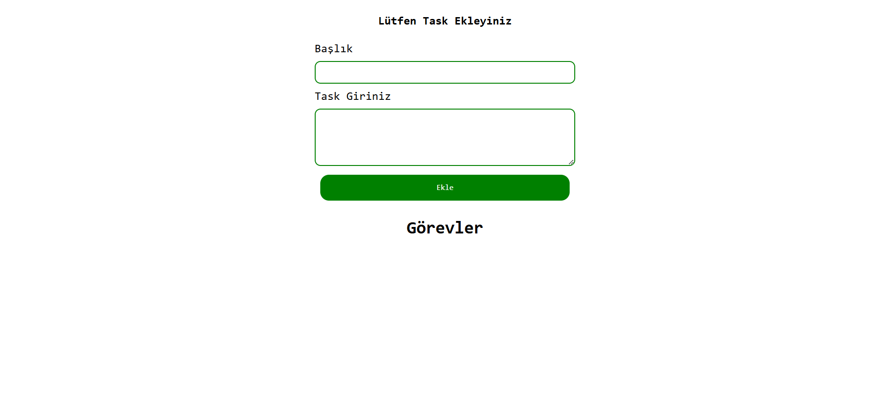
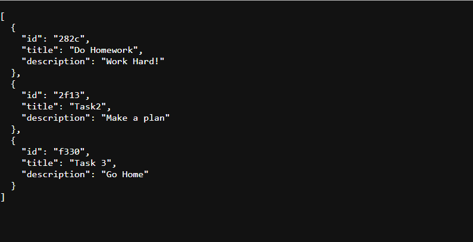
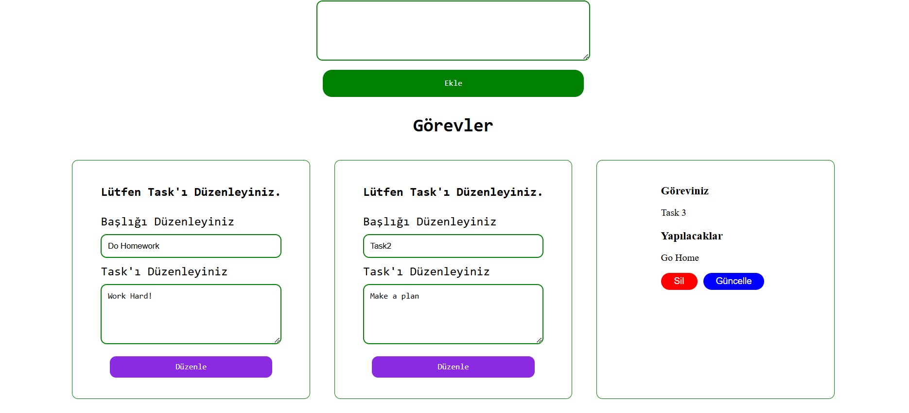
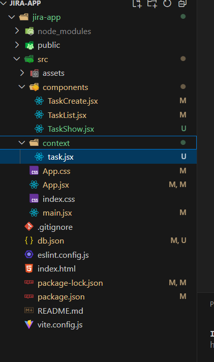

# React Jira Application

This project is designed to develop a basic Jira-like application using React. Users can add, delete, and edit tasks. The project utilizes `useState`, `useEffect`, `Json Server`, `Axios`, and `Context API`.

## 🛠️ Technologies Used

- **React.js**: Frontend development
- **useState**: State management in components
- **useEffect**: Managing side effects (fetching data, etc.)
- **JSON Server**: Creating a fake REST API
- **Axios**: Making HTTP requests
- **Context API**: Global state management

## 📚 Installation and Usage

### 1. Clone the Repository

```bash
git clone https://github.com/0Suphan0/react-jira.git
cd react-jira
```

### 2. Install Dependencies

```bash
npm install
```

### 3. Start JSON Server

```bash
npx json-server --watch db.json 
```

### 4. Start React Application

```bash
npm start
```

## 📝 Features

- Add tasks
- Delete tasks
- Edit tasks
- Global state management with Context API
- API communication using Axios

## 🎨 Screenshots








## 💌 Contact

If you have any questions about the project, feel free to reach out.

---

# React Jira Uygulaması

Bu proje, temel bir Jira uygulamasını React kullanarak geliştirmek için tasarlanmıştır. Kullanıcılar görev ekleyebilir, silebilir ve düzenleyebilir. Proje boyunca `useState`, `useEffect`, `Json Server`, `Axios` ve `Context API` kullanılmıştır.

## 🛠️ Kullanılan Teknolojiler

- **React.js**: Kullanıcı arayüzü geliştirme
- **useState**: Bileşenlerde durum yönetimi
- **useEffect**: Yan etkileri yönetme (veri çekme vb.)
- **JSON Server**: Sahte bir REST API oluşturma
- **Axios**: HTTP istekleri yapma
- **Context API**: Global state yönetimi

## 📚 Kurulum ve Kullanım

### 1. Depoyu Klonlayın

```bash
git clone https://github.com/0Suphan0/react-jira.git
cd react-jira
```

### 2. Bağımlılıkları Yükleyin

```bash
npm install
```

### 3. JSON Server'ı Başlatın

```bash
npx json-server --watch db.json --port 5000
```

### 4. React Uygulamasını Çalıştırın

```bash
npm start
```

## 📝 Özellikler

- Görev ekleme
- Görev silme
- Görev düzenleme
- Context API ile global state yönetimi
- Axios ile REST API iletişimi


## 💌 İletişim

Eğer proje hakkında sorularınız varsa, bana ulaşabilirsiniz.


